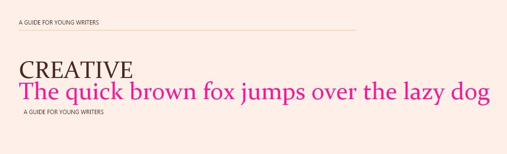

# Declarative Document Layout System

A prototype interpreter, renderer, and schema for declaratively designing documents in a manner similar to web and application UI design. 
This method of graphics design has the potential for dynamic layout creation for various document sizes, automation of document creation, 
and the benefit of explicitly laying out a document without the difficulty of using a clumsy WYSIWYG editor. The interpreter currently supports rending to screen with both Windows GDI and Google Skia.

## Tools Used

This project was implemented using C# and Visual Studio.

## Getting Started

The interpreter will look for *.ddl XML files in a 'demos' subdirectory in which the executable is located. Several examples are provided.

## Supported Elements
- Grid
- StackPanel
- DockPanel
- Rectangle
- TextBlock

## Schema (Declarative Design Language) Example
```xml
<?xml version="1.0" encoding="utf-8" ?>
<Grid ShowLayoutRectangles="true">
  <Rectangle Fill="#feefe9"></Rectangle>
  <StackPanel Margin="40 40 40 0">
    <TextBlock FontColor="#4b271e" FontFamily="Segoe UI" FontSize="12">A GUIDE FOR YOUNG WRITERS</TextBlock>
    <Rectangle Fill="#f6d8ba" Margin="0 8 0 0" Width="700" Height="2"></Rectangle>
    <TextBlock FontColor="#4b271e" FontFamily="Constantia" FontSize="50" Margin="0 50 0 0">CREATIVE</TextBlock>
    <TextBlock FontColor="#FF1493" FontFamily="Constantia" FontSize="50" Margin="0 -17 0 0">The quick brown fox jumps over the lazy dog</TextBlock>
    <TextBlock FontColor="#4b271e" FontFamily="Segoe UI" FontSize="12" Margin="10 5 0 0">A GUIDE FOR YOUNG WRITERS</TextBlock>
  </StackPanel>
</Grid>
```
### Output

